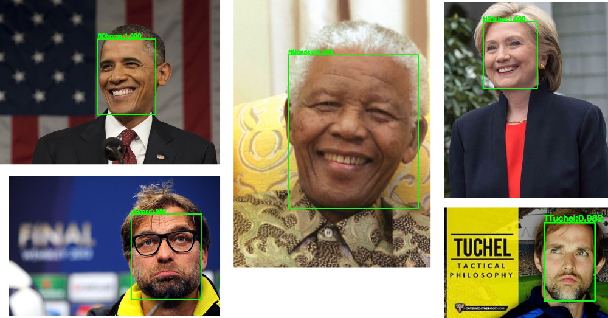
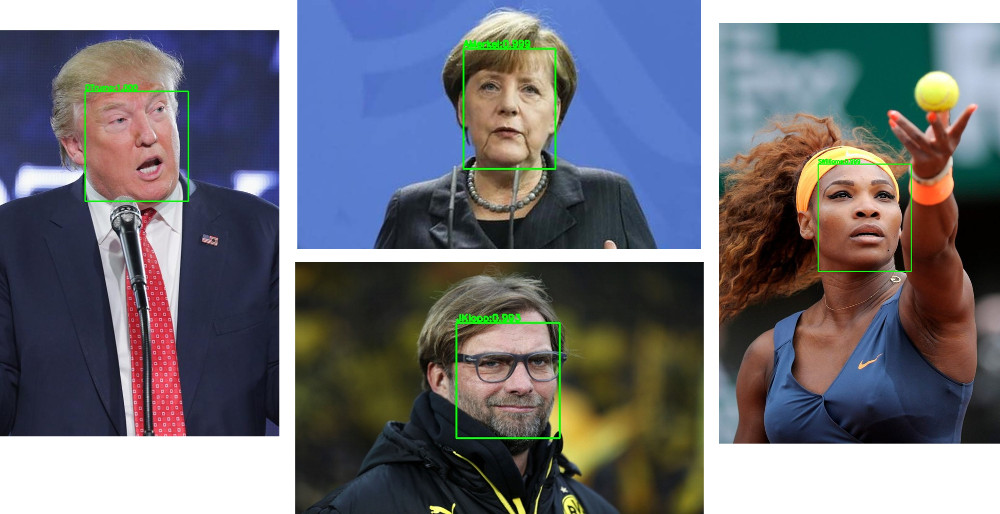

# faster_rcnn_face

Application of faster_rcnn in face recognition case

Setup by Romuald FOTSO

## Introduction:

This project aims to use the py_faster_rcnn tool to recognize face in real scene image. If your are interessed by the original project (python), please feel free to have a look [here](https://github.com/rbgirshick/py-faster-rcnn). We have setup a small dataset with only 24 classes, and launch a training with the VGG16 architecture. This repository involves all required files to launch a training or test process by your own. Indeed this page does not present the best model performance on our dataset, it just shows one more use case of the py_faster_rcnn project.



## Datasets:

We have setup our own dataset (24 cls) based on pascal_voc schema.
Required files are available here:
  * [ROMYNY Person 2017 : images+sets+annotations](https://drive.google.com/open?id=0B_Rjj_NgCayPM1EzQVkwM1VueW8)
  * [ROMYNY Person 2017 : labels](https://drive.google.com/open?id=0B_Rjj_NgCayPckh0N0FDVE0zbDA)
  
## Hardwares/Softwares:
    OS: Ubuntu 16.04 64 bit
    GPU: Nvidia GTX 950M 4G
    Cuda 8.0
    CuDNN 3.0.8
    Python 2.7.12
    OpenCV 3.1.0

## Prerequisites:

  1. Caffe [prerequisites](http://caffe.berkeleyvision.org/installation.html#prequequisites)
  2. Python's packages (requirements.txt)
  
## Installation:

To install this project, please follow the steps below:

1. [Install OpenCV](http://www.pyimagesearch.com/2016/10/24/ubuntu-16-04-how-to-install-opencv/)

2. Download the repository:

    ```
    $ cd /opt
    $ sudo git clone --recursive https://github.com/romyny/faster_rcnn_face.git
    $ cd faster_rcnn_logo
    ```
    
3. Install all externals repositories required:

    ```
    $ cd caffe-faster-rcnn
    ```
    
    Adjust Makefile.config, then
    
    ```
    $ sudo mkdir build
    $ cd build
    $ cmake ..
    $ make -j4
    $ make install
    $ cd ../..
    ```
    
    Install project's libs
    
    ```
    $ cd libs
    $ make
    $ cd ..
    ```
    
 4. Install python's packages required:

    ```
    for req in $(cat caffe-faster-rcnn/requirements.txt); do pip install $req; done
    ```
    
Get the data and models required:
1. Download the data and uncompress in 'data'
  * person.24cls: [Google Drive](https://drive.google.com/open?id=0B_Rjj_NgCayPM1EzQVkwM1VueW8) -> data/VOCdevkit2007

2. Download the models and uncompress in 'data/logo_models'
  * person_models (VGG16): [Google Drive](https://drive.google.com/open?id=0B_Rjj_NgCayPeFpramdSWkVBWXc) -> data/person_models
  * person_models (RestNet-101): coming soon
  
## Experiments:

1. Run the demo: 
    
    ```
    $ cd $faster_rcnn_face_DIR
    $ python tools/demo.py 
    ```
    Note: this script will be performed on the test set
    
    For help use the command: python tools/demo.py --help
    
2. Launch train & test process:

    ```
    $ cd $faster_rcnn_logo_DIR/experiments/scripts
    $ bash faster_rcnn_end2end_face.sh 0 VGG16 pascal_voc \
      --set EXP_DIR person_24cls RNG_SEED 42 TRAIN.SCALES "[400,500,600,700]"
    ```
    
## Our results
The model generated at the 30th iteration gives a mAP^0.5 = 0.7217

All results related to demo dataset will be saved at 'data/demo_out'



## Contact

Please feel free to leave suggestions or comments to Romuald FOTSO (romyny9096@gmail.com)    
